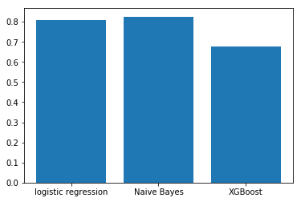

# Topic-Modelling-NLP

Using NLP techniques to categorize works of author based on their previous writings.

Dataset : https://www.kaggle.com/c/spooky-author-identification/data

Techniques :
                  - Classification based on number of words
                  
                  - WordCloud
                  
                  - Lemmatization
                  
                  - Vectorization
                  
                  - Logistic regression
                  
                  - Naive Bayes Classification
                  
                  - XGBoost
                  
Performace graph :

  

